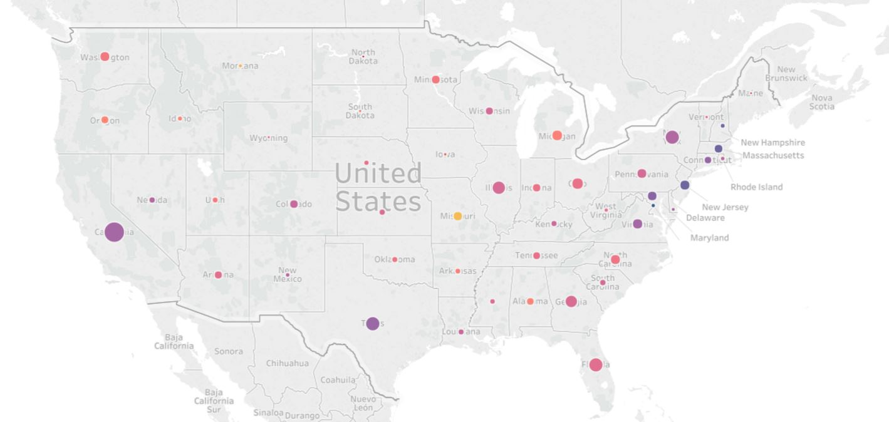
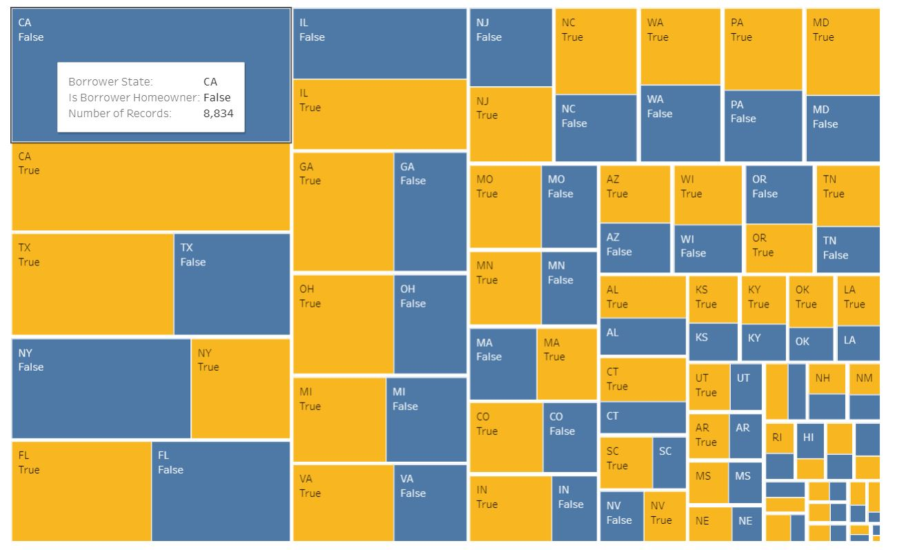

## Exploring the Loan Data from Prosper

Sofeware: Tableau  
Skills: Data visualization, Descriptive Statistics  
Used descriptive statistics and Chi Sqaure Test for Independence to investigate factors that made people more likely to survive.  
Link of the Tableau Story: https://public.tableau.com/profile/sally.ng3979#!/vizhome/ExploringtheLoanDatafromProsper/ExploringtheLoanDatafromProsper?publish=yes  

  

 

  

